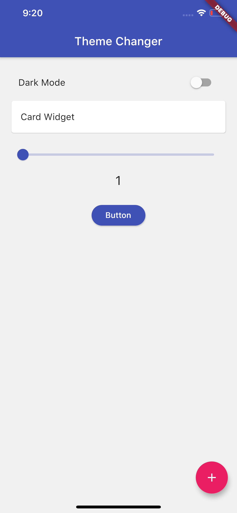
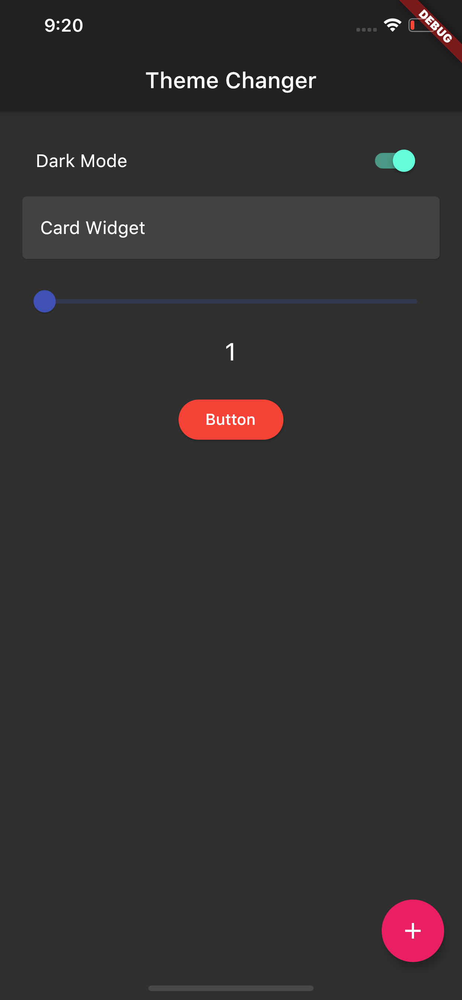

# Theme Changer App

[](https://GitHub.com/Naereen/StrapDown.js/graphs/commit-activity) [](https://github.com/sayannath)

> A basic Flutter app which is made with the help of the provider and shared preferences to change the theme from light to dark or vice-versa.
<br>

## 👉 If you like this repo then please give it a ⭐️

## Short Description
This Flutter app which helps you to find the chnage the theme of your phone.📳✨

## Plugins Used:
1. [provider](https://pub.dev/packages/provider)
2. [shared_preferences](https://pub.dev/packages/shared_preferences)


## Screenshots




## Project Structure
```
lib/
|- provider/
|- views/
|- main.dart

```

## How to run this
Running this is as simple as it gets. Follow this steps
1. Open your terminal (NOTE: git bash prefered/ Terminal on VS Code)
2. Navigate to the project folder where you have cloned this repo.
3. Open an emulator or plug in a real device
4. Type the following command in the terminal 
     ```
     flutter run
     ```
     
## Pull Request

Pull Requests are welcome. Please follow these rules for the ease of understanding:
* Make sure to check for available issues before raising one
* Give me a maximum of 24-48 hours to respond
* Have proper documentation on the parts you are changing/adding

#### Feel free to contribute

## Developed & Maintained by

[👨 Sayan Nath](https://sayan-nath.web.app/)<br>
[📷 Insta](https://www.instagram.com/sayannath235/)<br>
[🐤 Twitter](https://twitter.com/SayanNa20204009)<br>
[🧳 LinkedIn](https://www.linkedin.com/in/sayan-nath-15a989182/)
<br>

## Getting Started
For help getting started with Flutter, view our online [documentation](https://flutter.dev/docs).

[](https://github.com/sayannath)
